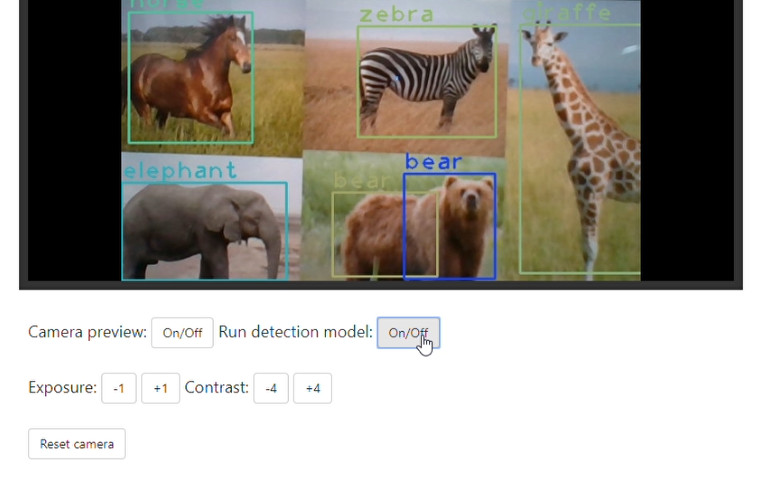

# Real-time object detection application

Web application for _real-time_ object detection on video streaming via web browser.

[](https://www.youtube.com/watch?v=3JUA47-QOKo&t=59s)

Watch the [demo video](https://www.youtube.com/watch?v=3JUA47-QOKo&t=59s).

## Installation

Create and activate an virtual environment, as follows:

```bash
$ cd cloned/directory/
$ python -m venv env
$ env/Scripts/activate
```

After have installed and activated the environment, install all the dependencies:

```bash
$ pip install -r requirements.txt
```

After that, you can run the _following command_ and access the application at [127.0.0.1:5000](http://127.0.0.1:5000/) on your browser.

```bash
$ python application.py
```

*obs.: This application was tested only on *Google Chrome*.*

## Download model

To download the `yolov3.weights`, just run:

```bash
$ cd models/
$ python dl-weights.py
```

## Usage

- **Camera preview**: Enables and disables the webcam preview.
- **Run detection model**: Enables and disables the detection model.
- **Exposure**: Buttons which increase or decrease camera exposure stops by 1.
- **Contrast**: Buttons which increase or decrease camera contrast stops by 4.
- **Reset camera**: Reset all camera settings based on _camera_settings.log_ file.
